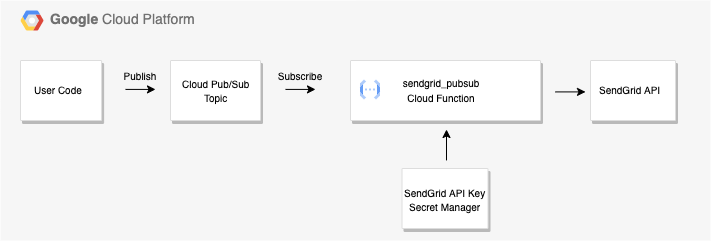
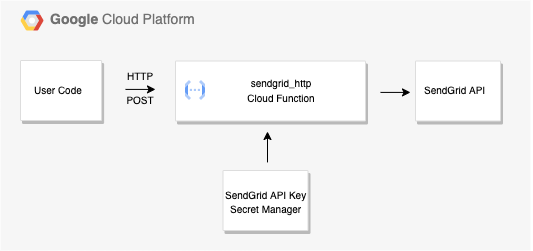

# Google Cloud Functions for calling SendGrid with Secret Manager

## Introduction

One of the needs that arises in cloud infrastructures is the ability to send email messages about the status of systems, error messages, or various findings.
Google Cloud offers a [list of suggestions](https://cloud.google.com/compute/docs/tutorials/sending-mail) one of which is SendGrid.
The purpose of this repository is to show how to use Google Cloud Functions to call the SendGrid API.

You can add the SendGrid API to your Google Cloud environment using the [Google Cloud Marketplace](https://cloud.google.com/marketplace).
The SendGrid API Marketplace page contains sample code in several languages but there are some additional matters to consider beyond calling the SendGrid API.
For exmaple:

1. How does one protect the SendGrid API key?
2. How can we route messages to SendGrid via Cloud Pub/Sub and support a protected API key?
3. Can we address all of these items in a modular manner to promote reusability?

We are going to look at how we can address these concerns using Google [Cloud Functions](https://cloud.google.com/functions) and [Secret Manager](https://cloud.google.com/secret-manager).
Cloud Functions is a serverless-compute capability that executes code based on an event such as a publication to Cloud Pub/Sub or an HTTP call.
Secret Manager provides the ability to protected sensitive value such as API keys and offers encryption along with version control.
The two Cloud Functions provided in this repository handle the work of fetching and decoding the SendGrid API key from Secret Manager and then calling SendGrid API.

## Use Cases

As mentioned above, there are two Cloud Functions in this repository that address two different use cases.

1. The sendgrid_pubsub Cloud Function is used to call SendGrid from a Cloud Pub/Sub topic.
You subscribe the Cloud Function to the topic.
When a publisher posts a messsage to the topic, Cloud Pub/Sub notifies the Cloud Function that a message is ready and the Cloud Function then fetches the API key from Secret Manager and then posts the message to SendGrid.  Here is a diagram of this use case.

    

2. The sendgrid_http Cloud Function is used to call SendGrid via an HTTP call. When the Cloud Function is called it fetches the API key from Secret Manager and then posts the message to SendGrid.  Here is a diagram of this use case.

    

## Prerequisites

You should be familiar with the implementation of the Google Cloud Console, GCP projects, IAM, Cloud Functions, and Secret Manager.
A knowledge of Cloud Logging will be helpful in identifying any errors that may arise during the deployments.

## Network and security considerations

1. The service account you use for these Cloud Functions does not need any project level IAM permissions.  You must, however, grant the service account Secret Manager Accessor permission to the secret containing the Sendgrid API key.  You can do this within the Secret Manager console.

2. Limit the flow of traffic to the function and accept the default of requiring authentication.  While you may choose to temporarily relax these constraints for testing purposes, enabling unauthenticated access and allowing all internet traffic increases the risk level substantially and is not recommended.

## Implementation guide

The procedures listed below are not step-by-step instructions but rather a guide to what must be done.
You should be famiiar with the Google Cloud console and have a general understand of the GCP services involved which include (but are not limited to) Cloud Functions, IAM, and Secret Function.  

1. Get a SendGrid API key.  You can do this by using the Google Cloud Marketplace.  Look for the SendGrid Email API product.  Make sure you are aware of any pricing considerations before buying SendGrid from the Marketplace.  As of the time this repository was created, there was a free tier but please check.  You will also need to aunthenticate your sender address or a domain.

2. Create a Secret Manager secret for the API Key.  The default secret name in the code is SENDGRID_API_KEY.
3. Create an IAM service account for the Cloud Function.  It does not need any project-level IAM permissions.
4. In the Secret Manager console, select the Secret, go to the Permissions tab and grant the service account the Secret Manager Accessor role.  You are attaching the permission to the secret resource.  You will not see this permmission in the project-level IAM settings.
5. For the Cloud Pub/Sub use case, create a Cloud Pub/Sub topic.
6. Here are the steps for deploying the Cloud Functions.
    1. Either clone this repository into Cloud Source Repositories or you can create a connected repository that points to this GitHub repository.
    2.  When you deploy each Cloud Function, make sure you set the folder path to the correct folder name so the deployment picks up the correct code. The function names and subdirectory names within the repository appear below.  Note that the function names use underscores ("_") while the subdirectory names use hyphens ("-").

        | Entry Point | Subdirectory | Description | Trigger Type |
        |-|-|-|-|
        |sendgrid_pubsub|sendgrid-pubsub|Consumes requests from a Cloud Pub/Sub topic|Cloud Pub/Sub|
        |sendgrid_http|sendgrid-http|Provides an HTTP endpoint for submitting email requests|HTTP|

    3. Select the trigger type associated with the function you are deploying.
    4. These functions were tested against the Python 3.9 framework.  Earlier versions may not work.
    5. Do not assign any environment variables or secrets to the Cloud Function.  The function will query GCP for the values it needs.
    6. Use the IAM service account you created earlier.
    7. For the Cloud Pub/Sub use case, specify the Cloud Pub/Sub topic that you created earlier.
    8. Study the main.py file in the function to see how errors are handled.  You may wish to change the error reporting.

## Testing the cloud functions

### The Cloud Pub/Sub use case

The sendgrid_pubsub function accepts a message containing a JSON string with the arguments listed in the table below.

| JSON Key      | Value |
|---------------|-------|
|project_id     | This is the GCP project ID in which the secret containing the API key resides.  This needs to be passed since the newest Cloud Function Python framework does not pass over an environment variable with the project ID like the older versions.|
|secret|This is the name of the Secret Manager secret that holds the Sendgrid API key.  The default secret name is SENDGRID_API_KEY.|
|secret_version|This is the version number of the secret.  The default is "latest" which means the most recent version of the secret.|
|from_address|This is the sender's email address.  You must validate this within Sendgrid.|
|to_address|This is the recipient's email address.|
|subject|This is the subject of the message. The default valueis an empty subject.|
|plain_text_content|The plaintext (not HTML) message. The default is an empty message.|

You can test the Cloud Function using the gcloud command similar to the example below.

    gcloud pubsub topics publish YOUR_TOPIC_NAME --message='
    {
        "project_id" :           "YOUR_PROJECT_ID",
        "secret" :               "SENDGRID_API_KEY",
        "secret_version" :       "latest",
        "from_address" :         "from@example.com",
        "to_address" :           "to@example.com",
        "subject" :              "This is a Test Message",
        "plain_text_content" :   "Hello world!"
    }'

### The HTTP use case

The sendgrid_http function accepts the arguments listed in the table below.

| JSON Key      | Value |
|---------------|-------|
|project_id     | This is the GCP project ID in which the secret containing the API key resides.  This needs to be passed since the newest Cloud Function Python framework does not pass over an environment variable with the project ID like the older versions.|
|secret|This is the name of the Secret Manager secret that holds the Sendgrid API key.  The default secret name is SENDGRID_API_KEY.|
|secret_version|This is the version number of the secret.  The default is "latest" which means the most recent version of the secret.|
|from_address|This is the sender's email address.  You must validate this within Sendgrid.|
|to_address|This is the recipient's email address.|
|subject|This is the subject of the message. The default valueis an empty subject.|
|plain_text_content|The plaintext (not HTML) message. The default is an empty message.|

Use the test option in the Cloud Functions console with the following JSON string to test the function.

    {
        "project_id" :           "YOUR_PROJECT_ID",
        "secret" :               "SENDGRID_API_KEY",
        "secret_version" :       "latest",
        "from_address" :         "from@example.com",
        "to_address" :           "to@example.com",
        "subject" :              "This is a Test Message",
        "plain_text_content" :   "Hello world!"
    }

## Suggestions for enhancements?

All suggestions are welcome!  Please see the [CONTRIBUTING.md](CONTRIBUTING.md) file for more information.
